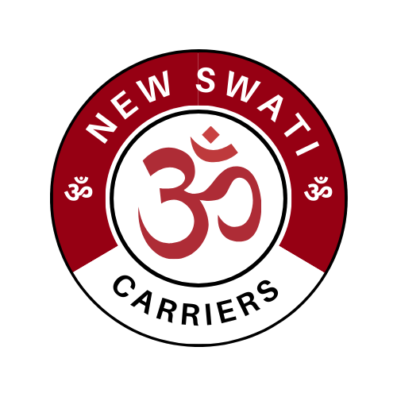

# 🚛 New Swati Carriers

  

 <!-- Replace this path with the actual location of your logo file -->

**New Swati Carriers** is a trusted transport service operating across **Uttar Pradesh**, India.  
We specialize in the safe and timely delivery of goods via our well-maintained fleet of trucks.

This dynamic web application allows **clients** to:
- Book transport services,
- Specify pickup & delivery locations,
- Make advance payments,
- And share feedback.

It also provides an **admin panel** for managing and confirming all bookings efficiently.

---

## 📦 Features

- 🔐 Secure Booking System for Clients  
- 🗺️ Pickup & Destination Location Input  
- 💵 Advance Payment Option  
- 📲 Real-time Booking Tracking  
- 👨‍💼 Admin Dashboard for Booking Approval  
- 💬 Client Feedback Submission  
- 🌐 Mobile & Desktop Responsive Interface  

---

## 🛠️ Tech Stack

- **Frontend**: HTML5, CSS3, JavaScript  
- **Backend**: PHP / Laravel  
- **Database**: MySQL  
- **Libraries & Plugins**: jQuery, AJAX, Summernote / CKEditor  

---
